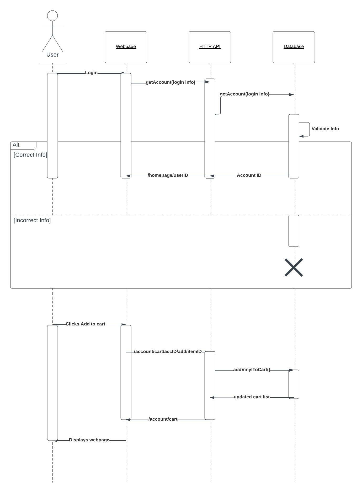
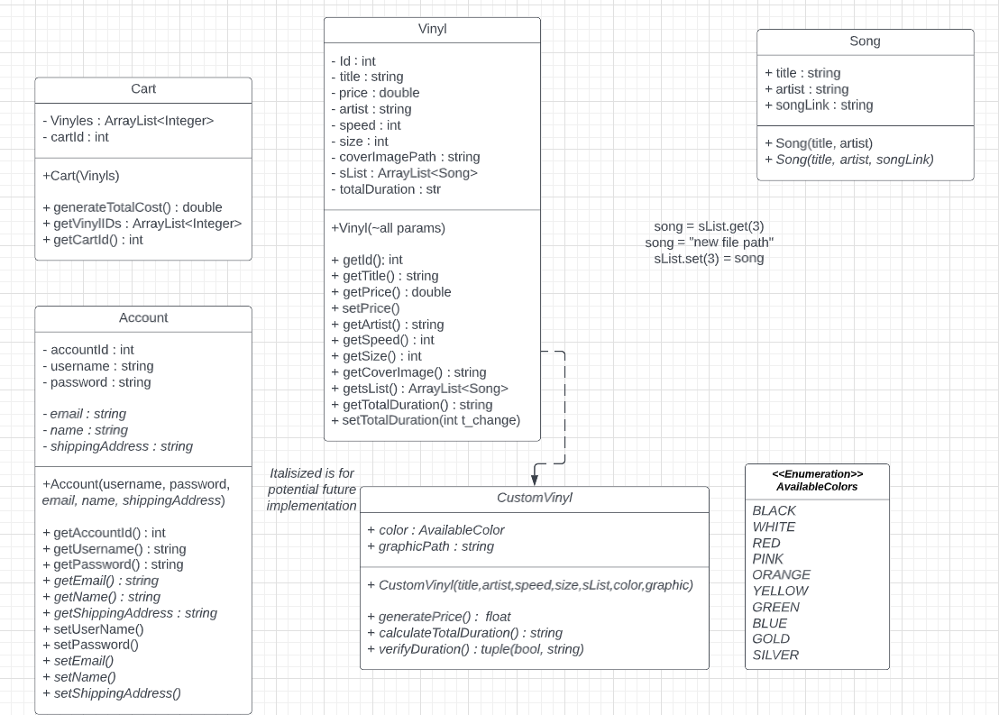
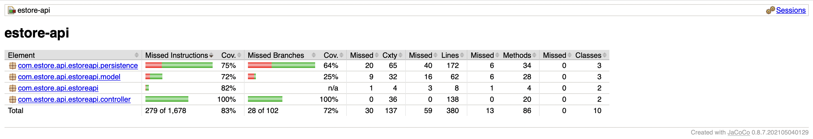

# PROJECT Design Documentation

> _The following template provides the headings for your Design
> Documentation.  As you edit each section make sure you remove these
> commentary 'blockquotes'; the lines that start with a > character
> and appear in the generated PDF in italics._

## Team Information

* Team name: Van Gogh Vinyl
* Team members
  * Connor Habe
  * Aaron Kersten
  * James McGuire
  * J Russ

## Executive Summary

Our application is for a store that sells vinyl records. Users will log in, and from there they can browse a variety of existing albums for purchase, or create a custom vinyl with their choice of speed, size, number of songs, as well as each song on the record.

### Purpose

Our application is not meant to be deployed to real commercial users, but our goal is to simulate as close to a genuine user experience as possible given the nature of the project. Short of entering payment details and shipping info, the website should feel like a real estore. We also aimed for it to be very user friendly, as we tried to eliminate the user "guessing" where to go next.

### Glossary and Acronyms

> _Provide a table of terms and acronyms._

| Term | Definition  |
| ---- | ----------- |
| SPA  | Single Page |

## Requirements

This section describes the features of the application.

* A user can login
* A user can view and search a list of products
* A user can add/remove a product to their cart and return to it later
* A user can purchase items
* An admin can login with unique login info
* An admin can edit the inventory
* A user can create and purchase a customized vinyl

### Definition of MVP

MVP for this application involves both the user and the admin being able to perform their required actions through the visual interface. This includes product and cart functionality for the user and inventory functionality for the admin.

### MVP Features

* Login system - user and admin have separate logins and pages
* Cart Functionality - add, remove, checkout
* Inventory Functionality - view, add, remove
* Front end - user can see and interact with application elements

### Roadmap of Enhancements

* Improve Admin functionality
* Improve Cart functionality
* Allow customers to customize their own vinyls

## Application Domain

This section describes the application domain.

A login by either a user or an admin gives access to account details. A user can only view/edit their own account information, but an admin has access to all users' information. A login also gives the user ability to manage their Cart. All users of the application can view and search through Inventory which contains vinyl records and custom records. Vinyl records have set attribute values, while custom records have values that need to be provided by the user.

## Architecture and Design

This section describes the application architecture.

### Summary

The following Tiers/Layers model shows a high-level view of the webapp's architecture.

The e-store web application, is built using the Model–View–ViewModel (MVVM) architecture pattern.

The Model stores the application data objects including any functionality to provide persistance.

The View is the client-side SPA built with Angular utilizing HTML, CSS and TypeScript. The ViewModel provides RESTful APIs to the client (View) as well as any logic required to manipulate the data objects from the Model.

Both the ViewModel and Model are built using Java and Spring Framework. Details of the components within these tiers are supplied below.

### Overview of User Interface

The landing page of our website is a typical homepage with an interactive header used to navigate to other pages of our website. From this header, a user can log in with their username, which gives them the ability to access the inventory of popular vinyl, where the user can add/remove from their shopping cart and proceed to checkout. If a user does not have an existing account, they can hit the 'sign up' button where they can create their own account. There is also a product dropdown, which is where you access the popular vinyl page (previously mentioned), as well as a custom vinyl creator. If the customer wishes to create a custom vinyl, they go through an add al the information that is prompted to them, and then the vinyl is added to their cart. There is also an 'about us' page, which has a little information about each of us.

### View Tier

The View Tier is responsible for the user interface and for implementing methods from the ViewModel and Model Tier to create a cohesive experience for the user. The header component is responsible for managing and displaying the header functionality. This includes the search bar and login as of now, but will be more robust as additional features are implemented. The vinyles component includes functionality for displaying vinyls to the screen. The vinyl component manages the logic for how vinyl are stored in a user's cart. The vinyl service aspect defines the methods for getting and search vinyls that are implemented in the two components. The user service implements methods that allow a user to login and add to their cart. The App component is the foundation of the web page which ties the components together.

### ViewModel Tier

The ViewModel Tier is what allows the user to interact with with program data. The two Controller classes in the controller package implement RESTful methods. These methods are implemented in the View Tier which allows intuitve control over vinyl and account data.

> Need UML Diagram(s)

### Model Tier

The Model Tier contains three dataclasses (Account, Song, and Vinyl) which hold the relevant data for an instance of that entity type. The Account and Vinyl DAO classes contain methods that allow the program to interface with user and vinyl data.

### Static Code Analysis/Design Improvements

> _Discuss design improvements that you would make if the project were
> to continue. These improvement should be based on your direct
> analysis of where there are problems in the code base which could be
> addressed with design changes, and describe those suggested design
> improvements._

> _With the results from the Static Code Analysis exercise,
> discuss the resulting issues/metrics measurements along with your analysis
> and recommendations for further improvements. Where relevant, include
> screenshots from the tool and/or corresponding source code that was flagged._

## Testing

### Acceptance Testing

Over the course of defvelopment, we have implemented a plethora of user stories, each with their own acceptance criteria. 

### Unit Testing and Code Coverage

We created tests for every .java class file in the main application. These tests ensure that the return values and set values for all of the mainn functions perform as expected. Our coverage targets are any method or class that will affect either the storage or retrieval of data from or vinyl and user json files. As of November 5th, 2022, post sprint3, we have achieved **83%** coverage.

